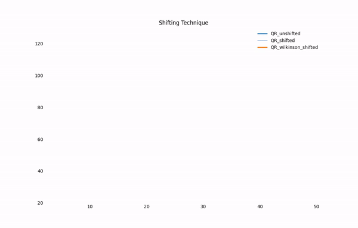
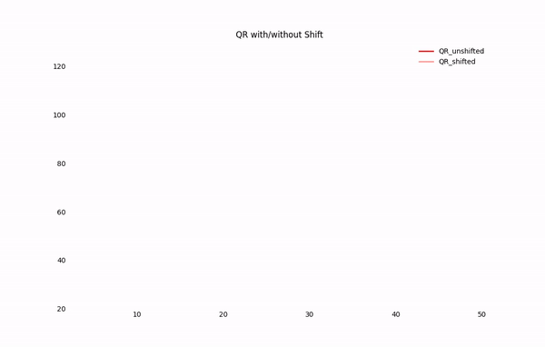
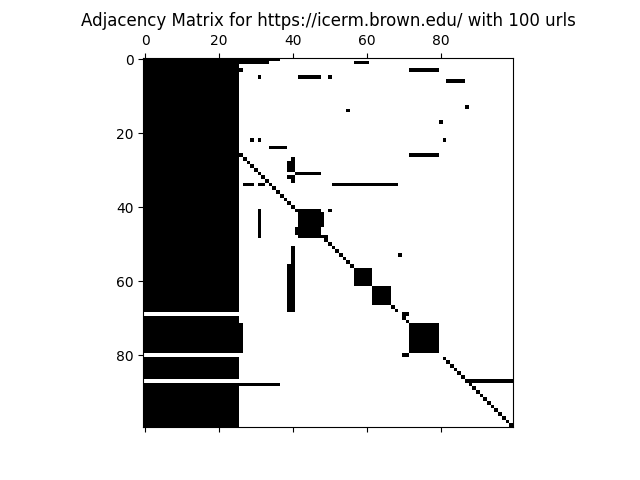
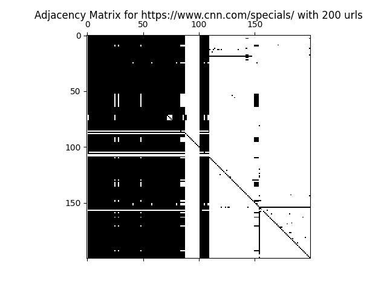
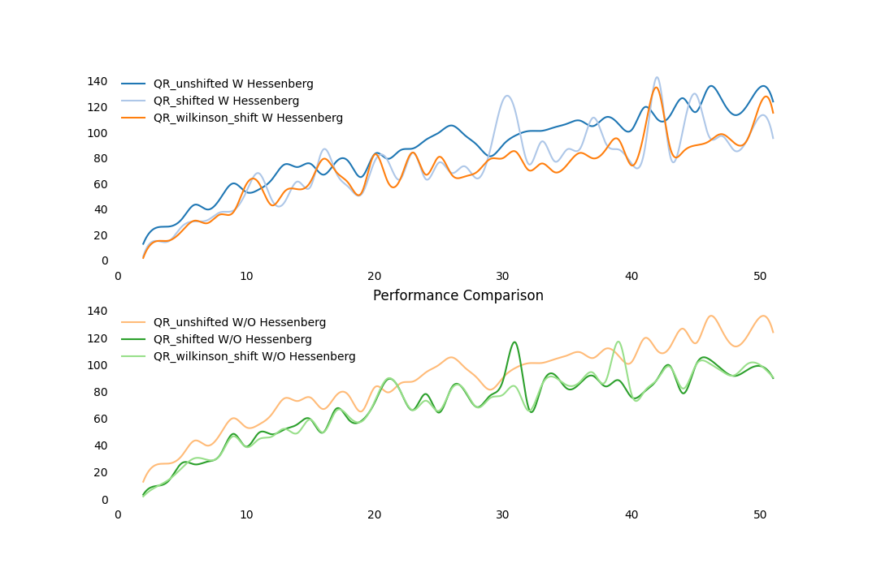
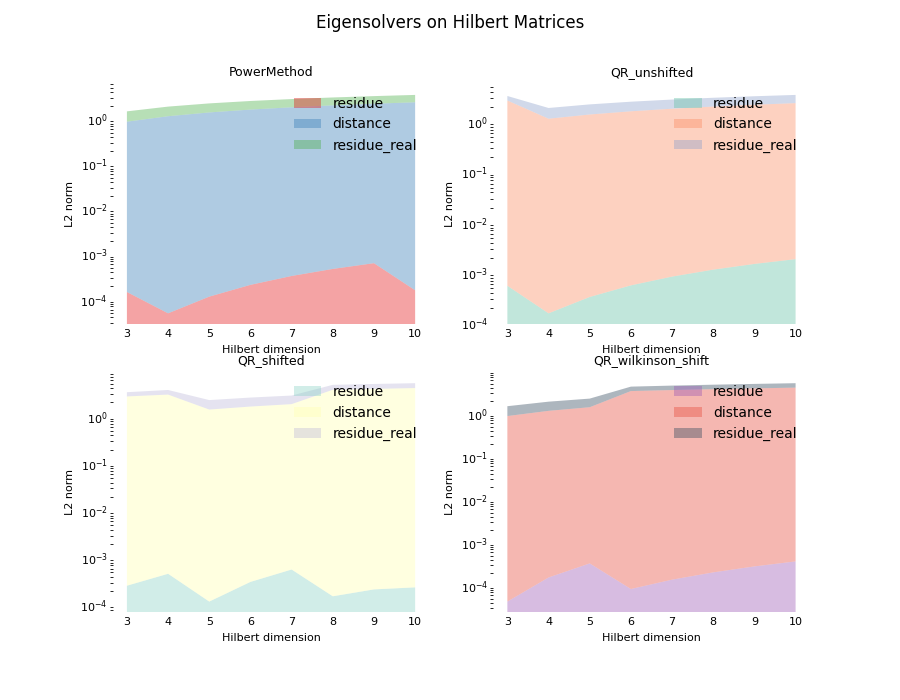

:-----:|:-----:
|
# Summer@ICERM 2020: Efficient Eigensolvers And Their Applications
 
:-----:|:-----:
  | 

> Welcome to our webpage for Efficient Eigensolvers! 
> This summer, we are working on solving eigenvectors and eigenvalues for a given matrix.
> Based on the non-existance of the closed formula for the root of an arbitrary polynomial with 
> degree 5 or more, we conclude there is no eigensolver that could solve
> the eigenvalues for an arbitrary matrix in finite steps even given 
> the perfect accuracy.
>
> Numerically, eigensolvers must be iterative.

In this project, we implemented variant [eigensovlers](#eigensolvers), built up [web crawlers](#webcrawler) with
 directed graph generator, constructed [performance comparison](#performance-experiments) code frame.
 
For numerical experiments results, we collected page rank scores for 
 subpages under several domains: https://icerm.brown.edu, https://en.wikipedia.com/wiki/,
 https://cnn.com/, etc. You can find the adjacency matrices and page rank results
  [here](#lets-rank).

 To see how preprocess of a matrix like reduction could save the run time,
 we measured **convergence rates** for different eigensolvers with and without
 **Hessenberg Reduction**.
 
 **Hilbert matrix**, a nightmare for generations of scientists working on 
 improving the time complexity of the eigensolver, is revisited by our code.
 We visualized how bad our eigensolers are when facing this accuracy dilemma
 caused by Hilbert matrix.

## Eigensolvers
We implemented two major kinds of eigensolvers:
* based on converged sequences.
    * [Power Iteration](PowerIterationMethod.html)
    * [Inverse Iteration with/without Shift]()
* based on Eigenvalue-revealing factorizations.
For example, Schur diagonalization.
    * [QR Algorithm](QR_Algorithm.html)
    
We also introduced other variants involving different techniques, e.g. [Rayleigh Quotient Iteration](RayleighQuotientIteration.html). 

## Webcrawler
A common application for eigensolvers, more specifically, Power Iteration Method,
is **PageRank**. By crawling all the subpages under a given domain, we generated a directed 
graph with vertices representing subpages and directed edges representing linkages by
[webcrawler](webScraper.html). 
By manipulating this directed graph's adjacency matrix and feeding it
into the eigensolver, we could converge to the dominant eigenvalue's eigenvectors,
where each value could be regarded as an **importance score**.

#### Let's rank!
* https://icerm.brown.edu/ : [Page Rank Scores](icerm_page_rank.csv)

* https://cnn.com/specials/ : [Page Rank Scores](cnn_page_rank.csv) 

## Performance Experiments
### Hessenberg Reduction with Shift

The time complexity for each plain eigensolver is O(n^3), which is problematic 
 for actual applications -- when we are crawling 10 million pages and processing
 a 10 million dimensional matrix -- the time consumed is not fun. 
 [Hessenberg Reduction](comparePerfDriver.html) comes to help.

### Hilbert Matrix
Let's face the [tricky Hilbert matrix](HilbertExper.html).

## Side notes:
if you also want to know how to ...
* [generate a random matrix](matricesGenerator.html)
* implement [adaptive page rank algorithm]()
* [manipulate the adjacency matrix]() in Page Rank algorithms
* [test the correctness]() for different algorithms

 

